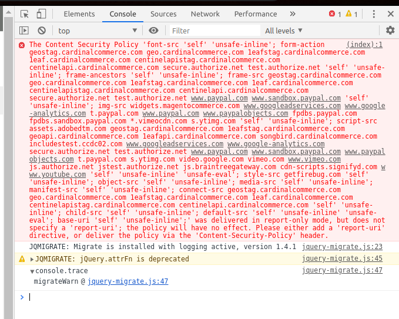

# mage2_ext_csp
Module to collect CSP violations reports and convert it to the CSP rules.

## Description
There are a lot of [Content Security Policy](https://developer.mozilla.org/en-US/docs/Web/HTTP/CSP) (CSP) warnings in Javascript console for Magento 2.3.5+:


This module adds `report-uri ...;` directive to CSP header, collects [reports](./docs/user/grid/reports.md) (separately for admin & front areas) then generates new [rules](./docs/user/grid/rules.md) to eliminate CSP warnings in console. Cron tasks to analyze reports & generate rules starts hourly.

The main goal of this module is to remove CSP errors from JS console completely but you can use this module to collect reports only (just disable activation for new rules in [config](./docs/user/config.md)).

You can switch CSP from report only to strict mode (set `Report Only` to `false` in config) after all violation reports will be converted to the rules and all not-allowed content will be locked by browser.

## Installation
`composer.json`
```
"require": {
    "flancer32/mage2_ext_csp": "*"
}
```

```shell script
$ ./bin/magento deploy:mode:set developer
$ composer require flancer32/mage2_ext_csp
$ ./bin/magento setup:upgrade
$ ./bin/magento deploy:mode:set production
$ ./bin/magento cache:clean
```


## Docs

- [Configuration](./docs/user/config.md)
- Grids:
  - [Violations reports](./docs/user/grid/reports.md) 
  - [CSP rules](./docs/user/grid/rules.md)
- [CLI](./docs/user/command.md)
- [Cron](./docs/user/cron.md)
- [DB structure](./docs/dev/db_struct.md)
