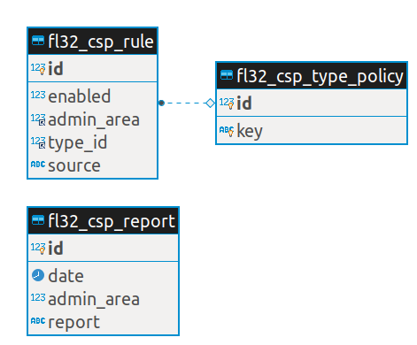

# Database Structure

## Tables

See [db_schema.xml](../../etc/db_schema.xml).

* **fl32_csp_report**: CSP violation reports;
* **fl32_csp_rule**: CSP rules (generated from CSP reports);
* **fl32_csp_type_policy**: CSP directives codifier (base-uri, img-src, ...);

