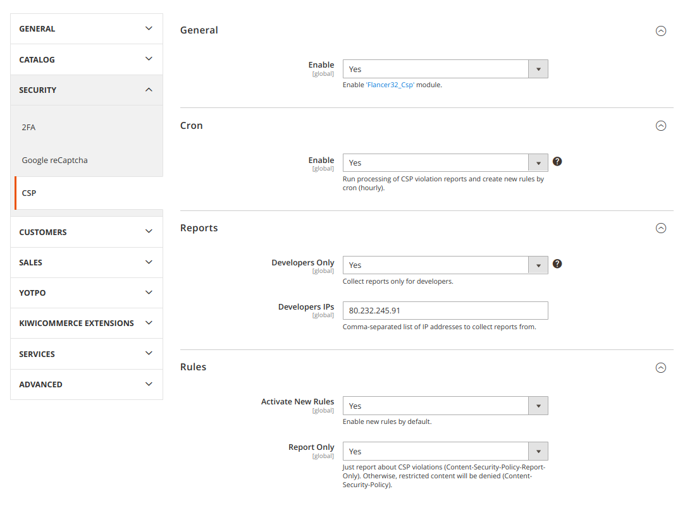

# Module Configuration

Go to `Stores / Configuration / Security / CSP`:

## General
Enable/disable module's functionality.

## Cron
Enable/disable cron task to process violations reports. This task starts every hour, analyzes reports and creates policy rules. Processed reports will be deleted.

## Rules
- **Activate New Rules**: `true` - cron task creates new rules and enables it; `false` - creates only (enable manually using SQL).
- **Report Only**: use `Content-Security-Policy-Report-Only` or `Content-Security-Policy` HTTP header for policy.
