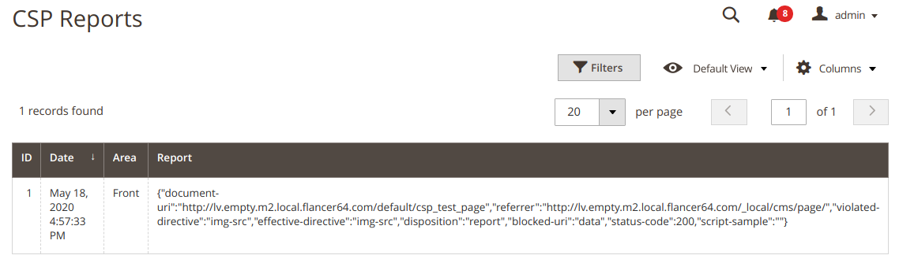

# CSP Violations Reports

Go to `System / Content Security Policy / CSP Reports` to get CSP violations reports:

- **Area**: the place where from violation has been reported (`Front`/`Admin`).
- **Report**: Violations data reported by browser (the `original-policy` property is removed from report before saving to reduce stored data).
