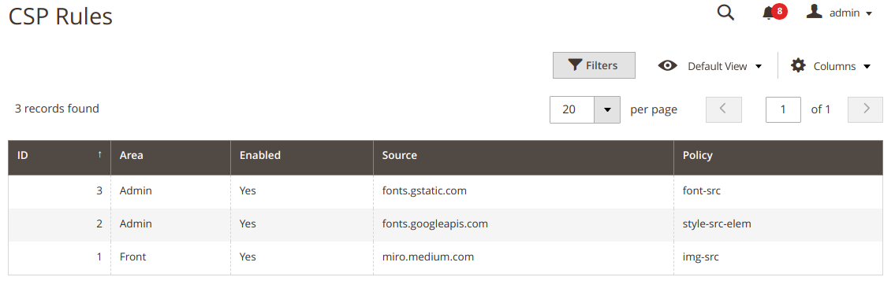

# CSP Rules

Go to `System / Content Security Policy / CSP Rules` to get additional CSP rules:

- **Area**: the place where to current rule will be applied.
- **Enabled**: `true` - this rule will be added to CSP header.
- **Source**: content of the policy directive.
- **Policy**: type of CSP directive.

